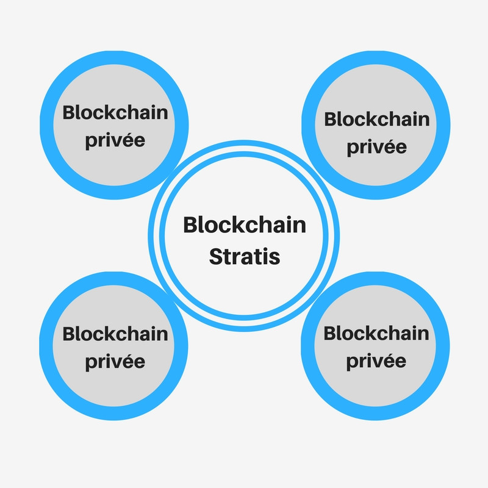

Une Blockchain publique (permissionless) est accessible pour tout le monde. Il vous suffit de télécharger l’ application client et vous pouvez utiliser le réseau sans que personne ne vous en empêche. Bitcoin est permissionless, il vous suffit de télécharger un wallet comme <a href="https://electrum.org/" target="_blank" rel="noopener nofollow" title="Electrum wallet">Electrum</a>pour commencer à utiliser le réseau.

Il y a des désavantages à ces Blockchains publiques. **La confidentialité** en est une. Tout le monde peut voir les transactions, ce qui peut poser problème pour les entreprises voulant protéger leur données.

**La performance** est également limitée. En Bitcoin, un bloc est rajouté toutes les 10 minutes et permet d’accepter jusqu’à 7 transactions par secondes. Si votre projet nécessite de grandes quantités de transactions, le réseau Bitcoin risque d’être un peu lent pour vous. **Les transactions ont également un coût**, et ces frais peuvent être élevés lorsqu’il y a beaucoup de transactions en attentes. Pour Ethereum, un bloc est ajouté toutes les 15 secondes environ, ce qui est déjà mieux, mais on est encore loin de concurrencer VISA ou MASTERCARD et les transactions sont également payantes.

De plus, elles ne sont pas forcément très personnalisable. Vous ne pouvez pas choisir votre mode de consensus par exemple. Ces désavantages peuvent poser problème pour des entreprises. Pour y remédier, on a vu l’apparition de Blockchains privées.

**Il y a plusieurs avantages aux Blockchains privées :**

- La modularité
- La confidentialité
- Plus de contrôle
- Meilleurs performances
- …

Avec une Blockchain privée, **vous pouvez adapter une Blockchain suivant vos besoins :**

- Choisir qui participe au réseau
- Vous définissez qui peut accéder à telle donnée
- Choisir un consensus alternatif

Pour comprendre, voici des exemples de Blockchain privées.

> Le but étant de comprendre ce que l’on peut faire avec une Blockchain privée. Je décris donc ci-dessous des caractéristiquesde Blockchains privées telles qu’elles sont au moment où j’écris cet article. Mais il faut bien comprendre que ces caractéristiques sont susceptibles d’évoluer avec le temps.

## Fabric Hyperledger

Fabric est vraiment complet, et permet de créer une Blockchain adaptée à ses besoins.

Pour les groupes de personnes nécessitant des transactions privées, **vous pouvez diviser votre Blockchain en plusieurs sous-réseaux** et choisir les informations que vous voulez partager entre ces sous-réseaux (<a href="https://hyperledger-fabric.readthedocs.io/en/latest/functionalities.html#privacy-and-confidentiality" target="_blank" rel="noopener nofollow" title="Hyperledger confidentialité">Doc</a>).

Il est possible d’y ajouter des Chaincodes (pouvant être considéré comme des Smart Contracts : <a href="https://hyperledger-fabric.readthedocs.io/en/latest/chaincode.html" target="_blank" rel="noopener nofollow" title="Hyperledger chaincode">Doc</a>), et donc rendre votre **Blockchain programmable**.

Un système de gestion d’identité (Identity management) permet** d’identifier ses employés sur le réseau** en leur donnant un ID. Vous pouvez par exemple, autoriser un employé à exécuter une application Chaincode, mais ne pas l’autoriser à déployer de nouveaux Chaincodes (<a href="https://hyperledger-fabric.readthedocs.io/en/latest/functionalities.html#identity-management" target="_blank" rel="noopener nofollow" title="Hyperledger gestion identité">Doc</a>).

Fabric Hyperledger vous permet donc de créer une Blockchain très personnalisée, en améliorant la confidentialité (partitionnement en sous-réseaux), le contrôle (ID management) etc.

Je ne vais pas décrire tous ce qu’il est possible de faire avec Fabric (vous ne voulez pas passer votre vie devant cet article par vrai). Vous pouvez retrouver la documentation <a href="https://hyperledger-fabric.readthedocs.io/en/latest/" target="_blank" rel="noopener nofollow" title="Hyperledger Fabric">ICI.</a>

## Quorum

Créé par JP Morgan,<a href="https://www.jpmorgan.com/global/Quorum" target="_blank" rel="noopener nofollow" title="Blockchain Quorum">Quorum</a> est basé sur Ethereum mais avec des fonctionnalités en plus.

- Vous avez plus de confidentialité, grâce à l’existence de transactions publiques et privées.

Les transactions publiques sont du même type que celles de la Blockchain Ethereum. N’importe qui participant au réseau peut les consulter. Cependant, **les transactions utilisent des GAS, mais ces GAS sont gratuits**. Les transactions publiques sont donc gratuites également.

Les transactions privées sont envoyées directement entre les destinataires spécifiés et leurs Hash est inclut dans la Blockchain Quorum. **Le contenu de ces transactions ne peut être consulté**. Cela est rendu possible grâce l’implémentation de ZSL ("Zéro-knowledge Security Layer" utilisé dans Zcash). Les transactions sont effectuées dans ce qu’on appelle un "Z-contract", mais ce contrat ne partage pas les informations de transactions.

- Des consensus alternatif.

Quorum propose le consensus Raft. Un noeud du réseau est désigné comme leader, et va donc se charger de publier les blocs.Ce mode de consensus permet d’avoir **un bloc rajouté à la Blockchain en seulement quelques millisecondes**.

Comment il fonctionne ? vous pouvez retrouver une explication du consensus Raft <a href="https://youtu.be/RHDP_KCrjUc?t=6m24s" target="_blank" rel="noopener nofollow" title="Consensus Raft">ICI</a>.

L’autre consensus est Quorum Chain fonctionnant avec un système de vote par Smart Contract. JP Morgan parle actuellement d’intégrer un nouveau consensus qui conviendrait mieux aux banques : IBFT (Istanbul Byzantine Fault Tolerance). Plus de détails sur Quorum et IBFT <a href="https://www.youtube.com/watch?v=7PpQS4hQP9A" target="_blank" rel="noopener nofollow" title="Consensus IBFT">ICI.</a>

## Stratis

Basé sur Bitcoin, <a href="https://stratisplatform.com/" title="Blockchain Stratis" target="_blank" rel="noopener nofollow">Stratis</a>utilise le principe des SideChains et vous permet de connecter votre Blockchain privée à leur Blockchain principale. Ils fournissent leur propre "Stratis Development Framework" vous permettant de développer vos applications Blockchain en C#.

Vous pouvez donc customiser votre propre Blockchain** tout en gardant avantage de l’infrastructure de la Blockchain principale**. Vous pouvez vous connecter à la Blockchain Stratis, et accéder à des informations (par exemple médicale, provenance de produits…) pour les consulter, les réutiliser etc. Cela peut également permettre aux entreprises de communiquer entre elles. Vous pouvez retrouver des exemples de cas d’utilisations <a title="Cas d'utilisation plateforme Stratis" href="https://stratisplatform.com/use-cases/" target="_blank" rel="noopener nofollow">ICI.</a>

Même si les Blockchains privées vont à l’encontre de certains principes d’une Blockchain : réseau décentralisé, données publiques… Elle permettent de résoudre bien des problèmes. Les entreprises ont toujours besoin de confidentialité, certaines infrastructures ou systèmes nécessitent de bonnes performances, et les Blockchains privées permettent de créer un système personnalisable et adapté à ces besoins.
