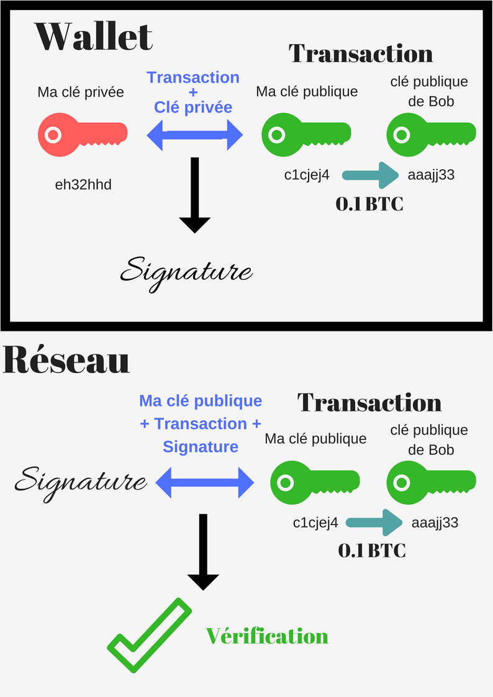

Un wallet sert bien évidement à stocker vos Bitcoins, d’où son nom. Voila j’espère que cet article vous a plu.

Non plus sérieusement, un wallet ne contient pas vos Bitcoins. Heureusement… imaginez votre ordinateur vous lâche et vous perdez tout ?  
Le mot "wallet" est en faite un très mauvais nom. **Votre wallet permet de protéger votre clé privée (ou vos clés privées)**, qui va vous permettre de signer des transactions afin de les envoyer sur le réseau.

Un wallet a pour but de :

## Calculer / retrouver la balance de votre compte

Comme vos crypto-monnaies ne sont pas stockées dans votre wallet, il va falloir retrouver votre balance dans la Blockchain.

**En Bitcoin il n’existe pas de balance** en tant que tel. Il n’existe que des transactions. Le wallet a donc pour but de retracer vos transactions pour connaitre votre balance.Avec Ethereum, une balance est associée à votre compte.

L’un des rôle du wallet est donc de retrouver la Balance de votre compte dans la Blockchain.

## Calculer les frais de transaction

Un wallet va également calculer les frais de transactions. Avec Bitcoin, ces frais sont calculés suivant la taille de la transaction. Avec Ethereum, ils sont calculés suivant sa complexité. Vous pouvez choisir de les diminuer, mais **plus vous payez de frais, plus votre transaction sera validée rapidement**, car les mineurs cherchent à valider les transactions avec le plus de frais (ils cherchent à maximiser leurs gains). Donc si vous diminuer les frais, votre transaction sera validée moins rapidement (voir jamais si les frais sont trop bas).

Enfin, sachez que **plus il y a de transactions en attentes plus les frais sont élevés.**Les transactions non confirmées s’accumulent dans le mempool en attendant d’être minées. Vous pouvez consulter la taille du mempool <a href="https://blockchain.info/charts/mempool-size" target="_blank" title="mempool blockchain" rel="noopener nofollow">ICI</a>. Vous pouvez également<a href="https://blockchain.info/unconfirmed-transactions" target="_blank" title="transactions blockchain" rel="noopener nofollow">voir les transactions non confirmées en temps réel</a>.

## Signer les transactions et les envoyer sur le réseau

Lorsque vous voulez envoyer de l’argent à quelqu’un, **votre wallet va construire la transaction.** Comme il contient votre clé privée, il va s’en servir pour signer cette transaction afin de l’envoyer sur le réseau.

La Blockchain est basée sur la cryptographie asymétrique. **En chiffrant votre transaction avec votre clé privée, on ne pourra la déchiffrer qu’avec votre clé publique.** Chaque wallet possède une clé privée et une clé publique.

Le wallet chiffre donc votre transaction avec votre clé privée pour obtenir une signature, et votre signature va pouvoir être déchiffrée sur le réseau avec votre clé publique. C’est en déchiffrant cette signature avec votre clé publique, que l’on peut s’assurer que la transaction vient bien de vous. Car **il n’y a qu’une seule clé privée associée à votre clé publique.**

Voici l’exemple avec un schéma dans lequel je veux envoyer 0.1 Bitcoin à Bob :

Dans ce schéma, je veux envoyer 0.1 Bitcoin à Bob. Mon wallet détient ma clé privée et ma clé publique. Ma clé publique est en faite mon adresse Bitcoin, et j’utilise l’adresse Bitcoin de Bob (et donc sa clé publique) pour lui envoyer des Bitcoins (une adresse Bitcoin est en faite un hash de la clé publique, mais je fais abstraction des hashs dans ce schéma).

Premièrement le wallet construit la transaction, et utilise ma **clé privée** et la **transaction** pour obtenir une **signature**. Le wallet envoie ensuite la signature et la transaction au réseau Bitcoin. Le réseau va ensuite utiliser ma **clé publique** et la **transaction** pour **vérifier la signature**.

Pour que la vérification fonctionne, le réseau doit obligatoirement utiliser ma clé publique (puisque la signature à été créée avec ma clé privée). De plus, **la transaction ne doit pas avoir été modifiée entre temps**. Nous avons utilisé la transaction pour créer la signature, puis le réseau réutilise cette même transaction pour vérifier cette même signature. C’est pourquoi le processus de vérification échouera si la transaction a été modifiée entre temps.

> "En réalité, on n’utilise pas la transaction elle-même dans la création de la signature et dans le processus de vérification, mais un hash de celle-ci. Je fais abstraction des hashs dans ce schéma pour plus de simplicité"

Le processus de vérification de la signature permet donc 3 choses :

1. **Authentification** : Il est possible d’identifier l’émetteur de la transaction (celui qui détient la clé privée).
2. **Non répudiation** : je ne peux pas nier avoir créer la transaction.
3. **Intégrité** : La transaction n’a pas été corrompue ou modifiée.

C’est pour cela, qu’il ne faut pas vous faire voler votre clé privée. Sinon quelqu’un peut se faire passer pour vous et donc voler vos crypto-monnaies ! **Seul la clé publique est partagée sur le réseau. La clé privée est gardée secrète dans votre wallet.**
