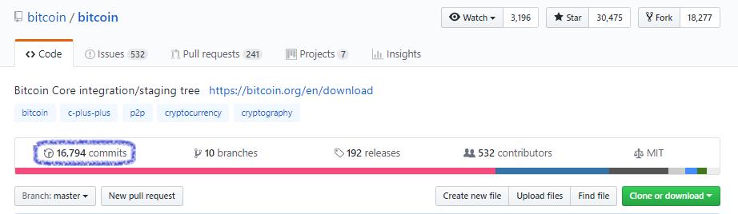
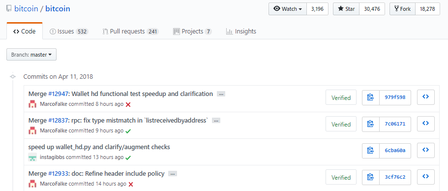
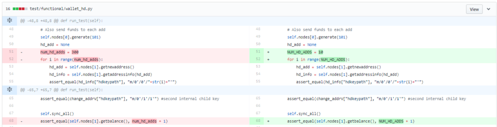
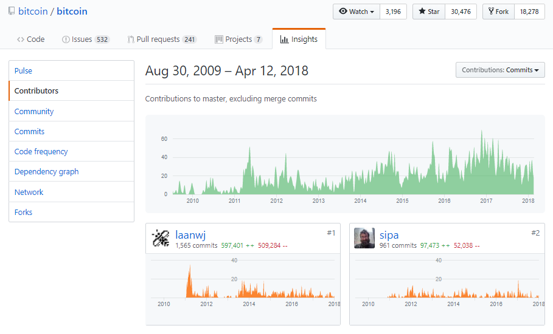
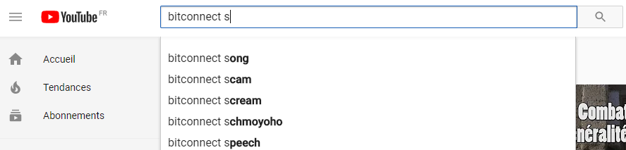
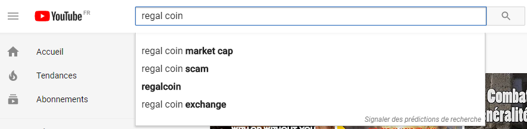
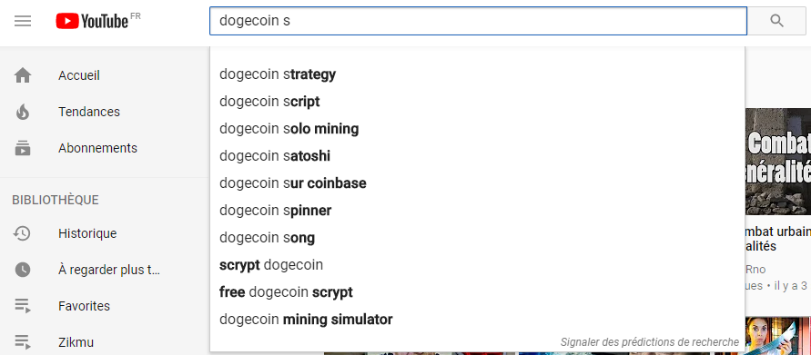
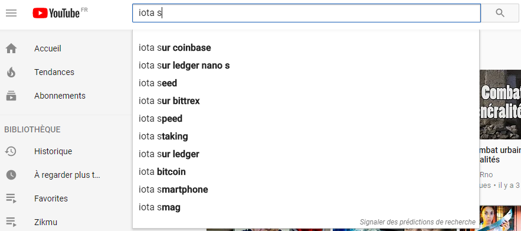

Il y a plus de 1500 crypto monnaies à l’heure où j’écris cet article. Et vous pouvez investir dans celles que vous souhAaitez. Génial, mais il faut savoir que ce domaine n’est pas encore régulé. Qui dit absence de régulations, dit arnaque. Certaines personnes récolte des fonds (à travers des ICO) et disparaissent ensuite dans la nature avec l’argent récolté.

Avant d’investir dans une crypto monnaie, il y a plusieurs points à vérifier que je vous décris dans cet article.**Le dernier point est le plus important**, n’investissez pas si tous les points listés vous semble bon, mais que le dernier point ne l’est pas.

## Lire le White Paper

Un document doit être publié. Il contient toutes les informations à propos du projet, c’est le "White Paper". Lisez bien ce document pour vous faire votre idée sur le projet.

Quel est le rôle du Token ? Il faut que vous compreniez bien son utilité. Essayez d’avoir une vision future : <a href="http://antoinetesner.fr/utiliser-la-blockchain-pour-mon-projet/" title="utiliser la blockchain pour mon projet" target="_blank" rel="noopener">Une Blockchain est-elle vraiment nécessaire pour ce projet ?</a> Si le projet n’est pas **décentralisé**, repensez-y 2 fois. Demandez-vous, si l’entreprise disparaît, le Token sera t-il toujours opérationnel ?

De quel manière le Token sera t-il distribué et quand ? S’il n’est pas pour vous, attention. Si plus de 50% des Tokens seront distribués à l’équipe, c’est également suspicieux.

Y a-t-il une **Roadmap** ? Vérifiez qu’il y ait bien des évolutions à venir, que le plan est bien décrit, et que l’équipe comprend bien les limites du projet. Le projet a-t-il été testé ? si non, quand le sera t-il ?

**Le White Paper ne doit pas être vague.** Il doit permettre de comprendre clairement les étapes du projet, les cas d’utilisation du Token (ou coin), son fonctionnement, quels problèmes il résout, et la valeur apportée.

## Soft cap et Hard cap

Dans le cas d’un ICO, un minimum et un maximum doivent être défini pour la capitalisation. Le soft cap est le minimum de fond requis pour lancer le projet.**Si le minimum n’est pas atteint, les investisseurs doivent être remboursés**. Il doit également y avoir un maximum (hard cap). S’il est atteint, la levé de fond doit stopper immédiatement.

## Vérifier les membres de l’équipe

Renseignez-vous sur les fondateurs du projet. **Cherchez leur nom sur google, visiter leur page LinkedIn**. Leurs expériences passées sont-elles cohérentes avec ce qu’ils font ? Les photos ont-elles l’air vrai ?

Y a-t-il des développeurs qui sont connues comme étant compétent ? C’est important, mener **un projet Blockchain est difficile, il faut des compétences**. Enfin, vérifier que l’entreprise existe bien, y a-t-il une adresse ?

**Si les fondateurs du projet sont anonymes, évitez d’investir.**

## Analyser la communauté

Allez faire un tour sur le forum, y a-t-il des questions et des réponses ? Si oui, c’est qu’il y a **une communauté active.** Vous pouvez aller faire un tour sur <a href="https://bitcointalk.org/" target="_blank" title="Bitcoin talk" rel="noopener nofollow">Bitcoin Talk</a>, <a href="https://steemit.com" target="_blank" title="Steemit" rel="noopener nofollow">Steemit</a>, le <a href="https://telegram.org/" target="_blank" title="telegram officiel" rel="noopener nofollow">Telegram</a> officiel (attention aux faux channel là aussi, vérifier bien le nom de leur Telegram sur leur site), <a href="https://www.reddit.com/" target="_blank" title="reddit" rel="noopener nofollow">Reddit</a>, <a href="https://discordapp.com/" target="_blank" title="discord channel" rel="noopener nofollow">Discord</a>…

Les créateurs du projet répondent t-ils ? Si non, attention. Vérifiez les messages critiques, **y a-t-il des alertes SCAM**, des gens mécontents ?

## Vérifier le Github

Le mieux est que le code soit **open source.** Cela permet à la communauté d’aider les fondateurs du projet, et cela donne de la **crédibilité**. Allez jeter un code d’œil au code source sur Github (même si vous n’êtes pas développeur). Vous devrez trouver le lien sur leur site officiel.

Regardez tout d’abord le nombre de commits et leur fréquence.**Un commit est une modification de code apporté par un développeur.** Dans la partie "commit" de Github, vous pouvez donc voir toutes les modifications apportés au projet. S’il y en a beaucoup, c’est que l’équipe **travail activement au développement du projet.**

Exemple avec le Github Bitcoin :

Le nombre de commits s’élèvent à ce jour (12 avril 2018) à presque 17 000. En cliquant sur le nombre de commits, vous pouvez voir tout l’historique :

Vous avez la liste de toutes les modifications qui ont été apportés. Chaque commit possède une description de ce qui a été fait et à quelle date. Les derniers commits date d’hier (11 avril). Si le projet **n’as pas été mise à jour depuis longtemps**, cela peut signifier que le projet est **abandonné** (ou faux…).

Vous pouvez aller plus loin en cliquant sur un commit :

Sur ce type de page, où vous pouvez comparer la différence avant (à gauche) et après (à droite) une modification. Vous pouvez voir les parties du code qui ont été ajoutées (en vert) ou supprimées (en rouge).

La partie "Insight" est également importante. Vous pouvez voir l’activité du Github au cours du temps, les contributeurs etc :

Vérifier que **l’activité générale soit forte.** Vous pouvez également aller voir le Github des contributeurs.

Avant d’investir dans un projet, aller donc faire un tour sur leur Github et vérifiez bien l’activité. Si le Github n’est pas public, est-il prévu qu’il le devienne prochainement ?

## Rechercher le mot clé "Scam" (très important)

Une méthode consiste à aller sur Youtube, et à rechercher le nom de la crypto monnaie dans laquelle vous voulez investir. **Si vous voyez le mot "Scam" dans les suggestions**, c’est qu’il y a de fortes chances pour que cette crypto monnaie soit une arnaque. Exemple avec Bitconnect et RegalCoin :

Taper le nom de la crypto-monnaie **sans même taper le mot "Scam".** Si ce mot apparaît, cela signifie que les gens pensent que c’est une arnaque, dans ce cas pourquoi investir ? Recherchez ensuite sur google, il est fort probable que vous tombiez sur un article qui explique en quoi c’est une arnaque.

Si l’on essaie avec 2 autres crypto-monnaie plus connues, pas de problème :

Cette méthode est à privilégier. Renseignez-vous sur internet en recherchant le nom de votre crypto-monnaie + le mot "Scam". Si les gens pensent que c’est une arnaque, ne prenez pas le risque d’investir. Si tous les points listés dans cet article sont au vert mais que ce dernier est au rouge, n’investissez pas.

## Récapitulatif des alertes

- Equipe anonyme.
- Blockchain inutile.
- White Paper trop vague.
- Pas d’activité sur Github.
- Communauté inactive (pas de questions et réponses) ou communauté mécontente.
- Pas de roadmap.
- Entreprise non enregistrée, pas d’adresse.
- Mot "Scam" associé à la crypto monnaie et articles décrivant une arnaque sur internet.
