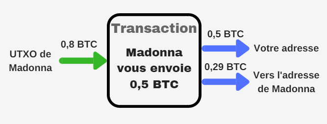
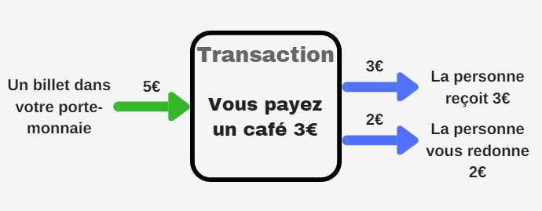
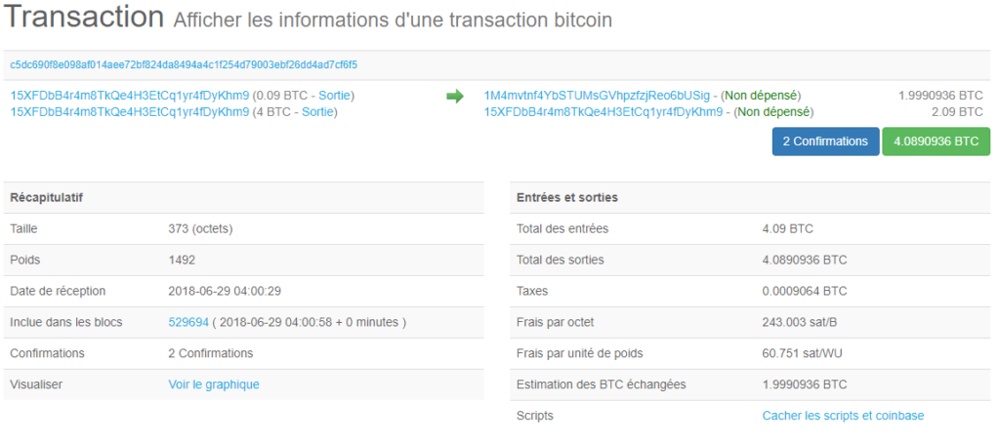

En Bitcoin, il n’existe pas de Balance associée à votre compte. Chaque transaction dispose d’Inputs et d’Outputs. **Les UTXO (Unspend Tansaction Output) sont des outputs de transactions qui n’ont pas encore été dépensés.** Si vous avez reçu 1 Bitcoin, vous avez 1 UTXO d’une valeur de 1 Bitcoin pouvant être réutilisé en input pour une prochaine transaction.

## Exemple d’une transaction
Prenons l’exemple suivant où Madonna vous envoie 0,5 BTC :  

Cette transaction dispose d’un seul input (en vert) et de 2 outputs (en bleu). Il se trouve que Madonna a reçu 0,8 BTC par le passé, et ne les a pas encore dépensés. Cette UTXO de 0,8 BTC est donc réutilisé en input pour la transaction.

**Les UTXO sont indivisibles. Il est donc impossible d’utiliser directement 0,5 BTC en entrée, car la valeur de cette UTXO est de 0,8.Il peut y avoir plusieurs inputs, mais ici un seul suffit car 0,8 est supérieur à 0,5.**

Nous avons donc 0,8 BTC en entrée, mais Madonna veut vous envoyer 0,5 BTC (pas 0,8). Le wallet va donc créer 2 outputs :

- 1 output de 0,5 BTC vers votre adresse : ce sera un UTXO que vous pourrez réutiliser pour une prochaine transaction.
- 1 output de 0,29 BTC vers l’adresse de Madonna : on appelle cela **le "change"**.

Vous disposez maintenant d’un UTXO de 0,5 BTC, que vous pourrez réutiliser en input pour une prochaine transaction.

## A quoi sert le change ?

Prenons un exemple où vous voulez vous payer un café qui coûte 3€ :

- Vous regardez dans votre porte-monnaie ce que vous pouvez dépenser. Tout comme le wallet regarde les UTXO que vous pouvez utiliser.
- Chaque billet et chaque pièce ont leur valeur en Euro, de même que chaque UTXO a une valeur en BTC.
- Vous décidez d’utiliser votre billet de 5€. **Ce billet est indivisible (tout comme les UTXO).** Vous ne pouvez pas déchirer votre billet pour ne donner que 3€. Vous allez donc donner votre billet de 5€, et la personne va vous rendre 2€ (c’est le change).

Au final, on se retrouve avec :

- 1 input (le billet de 5€).
- 2 outputs : 3€ vers la personne et 2€ de retour vers votre porte-monnaie (le change).

Dans notre premier exemple, il y a 0,29 BTC qui revienne vers Madonna. En faisant le calcul, on se rend compte qu’il manque 0,8 – (0,5+0,29) = 0,01 BTC. Cet écart correspond aux frais de transaction.

## Les frais de transaction

Pourquoi 0,29 BTC pour le change et pas 0,30 ?

La somme des outputs n’est pas égale à la somme de inputs. **L’écart qu’il y a entre la somme des inputs et la somme des outputs, correspond aux frais** que vous allez payer au miner :

> SOMME(inputs) – SOMME(outputs) = frais

Dans notre exemple, la valeur de l’input est de 0,8. La somme en output est de 0,79 (0,5 + 0,29). Les frais de cette transaction s’élèvent donc à 0,8 – 0,79 = 0,01. Cette somme de 0,01 Bitcoin a été reçue par le miner.

**Lorsque que vous développez un wallet, il ne faut pas oublier de créer un output de change vers le wallet de la personne qui envoie des Bitcoins. Sinon cette somme (la différence input output) sera payée au miner. Si le change avait été oublié dans notre exemple, Madonna aurait payée 0,3 BTC de frais (0,8 – 0,5).**

## Exemple avec une vraie transaction Bitcoin

Prenons <a href="https://www.blockchain.com/fr/btc/tx/c5dc690f8e098af014aee72bf824da8494a4c1f254d79003ebf26dd4ad7cf6f5" target="_blank" title="blockchain transactions" rel="noopener nofollow">cette transaction</a> sur blockchain.com :

Dans cette transaction, 2 inputs proviennent de l’adresse commençant par "15XF" : 0,09 et 4 BTC. Puis 1 output de 1,9990936 BTC pointe vers l’adresse commençant par "1M4m". 1 autre output de 2,09 BTC revient vers l’adresse "15XF". Il s’agit du change.

L’adresse "15XF" a donc envoyée 1,9990936 BTC à "1M4m". C’est ce qui est indiqué dans "Estimation des BTC échangées".

Dans "Total des sorties", il y a la somme des outputs :4,0890936 BTC (1,9990936 + 2,09). En faisant le calcul "Total des entrées" – "Total des sorties", on obtient les frais : 4,09 – 4,0890936 =0,0009064 BTC. C’est la somme qui est indiquée dans "Taxes".

Contrairement à Ethereum où une balance est associée à chaque compte, il n’y a que des inputs et outputs en Bitcoin. <a href="http://antoinetesner.fr/role-wallet-bitcoin/" target="_blank" title="bitcoin role d'un wallet" rel="noopener">Votre wallet se charge</a> de retrouver tous les UTXO que vous détenez pour calculer votre balance.
