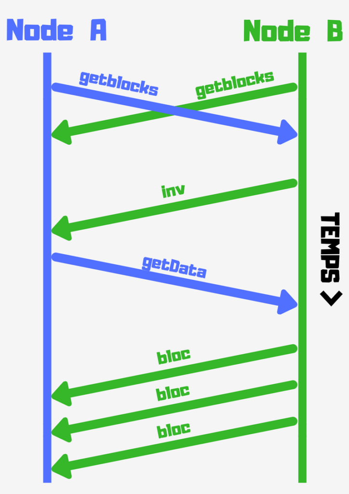
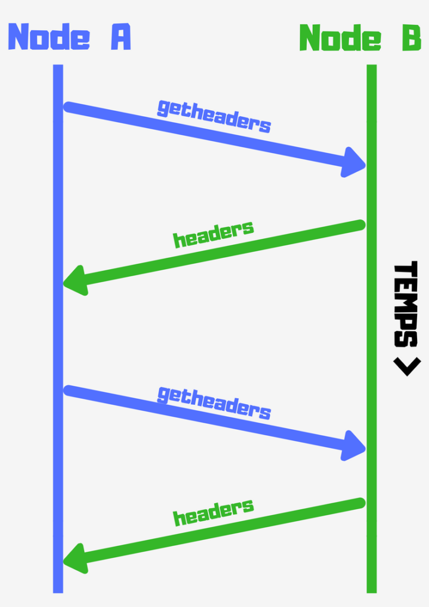
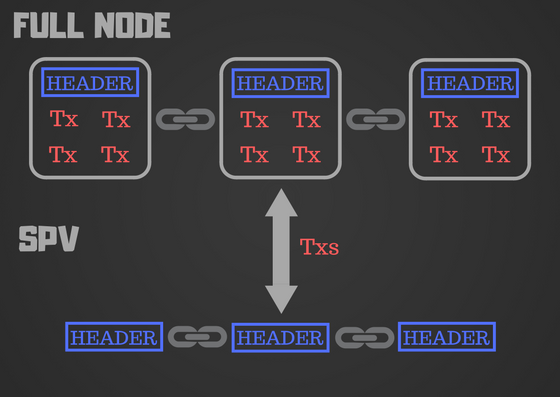

La taille de la Blockchain Bitcoin ne cesse d’augmenter. Elle a dépassé les 150 Gigas à l’heure où j’écris cet article. Heureusement, personne ne vous oblige à la télécharger entièrement pour faire vos transactions.

Ils existent plusieurs type de noeuds dans le réseau Bitcoin : Les Full Nodes, les SPV, les Miners… **Un noeud est simplement un ordinateur connecté au réseau Bitcoin.** Selon son type (Full-node, SPV…), il va avoir un rôle différent dans le réseau. Dans cet article, on ne s’intéresse qu’à la différence entre les Full Nodes et SPV.

## Les Full Nodes

Les Full Nodes sont des noeuds qui téléchargent toute la Blockchain.**Ce sont eux qui valident les blocs et transactions, pour ensuite les relayer aux autres.**

Ils se connectent entre eux en Peer to Peer, et échangent des messages "getblocks", contenant le hash du bloc le plus récent de leur Blockchain. Ils peuvent ainsi savoir si un autre Full Node a une Blockchain plus récente. Le Full Node avec la Blockchain la plus récente, va ensuite identifier les 500 prochains blocs à transmettre. Il transmet les hashs de ces blocs via le message "inv" aux autres nœuds, qui vont télécharger ces blocs avec une série de messages "getdata" :

> "Schéma tiré du livre <a href="https://www.amazon.fr/gp/product/1491954388/ref=as_li_tl?ie=UTF8&amp;camp=1642&amp;creative=6746&amp;creativeASIN=1491954388&amp;linkCode=as2&amp;tag=dealsbuilder-21&amp;linkId=563dfd9dcac2fe26200f413cb3f188c7" target="_blank" title="mastering bitcoin" rel="noopener nofollow">Mastering Bitcoin</a>"

En résumé les Full Nodes cherchent à savoir qui a la Blockchain la plus récente grâce à des messages "getblocks". Ils reçoivent en réponse des messages "inv" contenant les hashs des blocs manquants. Puis ils téléchargent ces blocs avec des messages "getdata".

Tout le monde ne peut pas se permettre de faire tourner un Full Node, car il faut de l’espace disque et un minimum de performance. Mais **cela reste le moyen le plus sûr d’utiliser Bitcoin, car vous êtes certain que toutes les règles Bitcoin sont respectées**. Comme par exemple le fait qu’aucun Bitcoinn’appartenant pas au propriétaire n’est dépensé, qu’aucune valeur n’a été dépensée deux fois…

Les Full Nodes sont actuellement le moyen le plus privé d’utiliser Bitcoin. Personne ne peut analyser quelles adresses Bitcoin vous appartiennent. De plus, ils ne souffrent pas de nombreuses attaques qui affectent les SPV.

## SPV (Simplified Payment Verification)

Les SPV (Simplified Payment Verification) également appelé "Lightweight Node", ne **téléchargent que les entêtes des blocs,** et non toutes les transactions incluses dans chaque bloc.La taille de la Blockchain (sans les transactions) peut être réduite par 1000. Cela vous offre **l’avantage de faire tourner un wallet SPV sur un smartphone par exemple.**

**Les SPV interrogent ensuite les Full Nodes**, et ne demandent que les transactions qui les intéressent. Contrairement aux Full Nodes, ils ne sont donc pas autonome, car ils dépendent de ces derniers pour trouver les transactions dont ils ont besoin.

> "Schéma tiré du livre <a href="https://www.amazon.fr/gp/product/1491954388/ref=as_li_tl?ie=UTF8&amp;camp=1642&amp;creative=6746&amp;creativeASIN=1491954388&amp;linkCode=as2&amp;tag=dealsbuilder-21&amp;linkId=563dfd9dcac2fe26200f413cb3f188c7" target="_blank" title="mastering bitcoin" rel="noopener nofollow">Mastering Bitcoin</a>"

**Les SPV ne téléchargent donc que les entêtes de chaque bloc dans lesquelles se trouvent plusieurs informations (merkle root, hash du précédent bloc…).** Nous allons voir dans la prochaine section, comment ils valident les transactions, et comment ils trouvent vos <a href="http://antoinetesner.fr/bitcoin-transaction-comprendre-utxo/" target="_blank" rel="noopener">UTXO</a>pour calculer votre balance.

## Validation des transactions

Pour faire un inventaire des <a href="http://antoinetesner.fr/bitcoin-transaction-comprendre-utxo/" target="_blank" title="bitcoin transaction utxo" rel="noopener">UTXO</a>, un Full Node va parcourir tous les blocs de sa Blockchain, alors qu’un SPV va utiliser la profondeur du bloc.

Imaginons que l’on veut vérifier une transaction dans le bloc 300 000. Un Full Node va lier tous les blocs à partir du 300 000 ème jusqu’au genesis bloc (le premier bloc), et créer une base de données de tous les UTXO. **La transaction sera validée si l’UTXO est bien non dépensé.**

Un SPV ne peut pas savoir si un UTXO reste non dépensé, car il ne détient pas toutes les transactions. Il va établir un lien entre la transaction et le bloc qui la contient, pour vérifier que la transaction se trouve bien dans ce bloc.

> "Les entêtes des blocs contiennent ce que l’on appelle le merkle root. Grâce au merkle root, un SPV peut vérifier qu’une transaction se trouve bien dans un bloc sans télécharger le bloc lui-même."

Puis il attend les 6 prochains blocs (300 001 à 300 006). Le fait que les Full Nodes aient acceptés 6 blocs de plus, prouve que la transaction est valide.

Les SPV sont la solution si vous ne pouvez pas vous permettre de faire tourner un Full Node. **Ils ne sont cependant pas à l’abri d’attaques, car ils ne détiennent pas toutes les transactions.** Ils ne peuvent donc pas vérifier que toutes les règles Bitcoin sont correctement suivies. Enfin, parce-que leurs demandes sont spécifiques, cela peut poser des problèmes de confidentialité. C’est pourquoi les développeurs ont créés le **Bloom Filter.**

## Bloom Filter

Le fonctionnement des SPV peuvent causer problème au niveau de la confidentialité.**En analysant les requêtes d’un SPV, on peut deviner quelles sont les transactions qui l’intéresse.** Et donc deviner l’adresse du wallet.

Le Bloom Filter permet d’éviter cela.

Au lieu de demander la transaction directement, **le SPV défini un filtre des transactions qu’il veut.** Il ne recevra donc pas uniquement la transaction qu’il a demandé, mais plusieurs transactions qui correspondent à la demande. Parmi elles, se trouve la transaction qui l’intéresse.**Il est donc plus difficile de reconnaître les transactions demandées par le SPV, car elles sont noyées dans d’autres transactions.**

Vous pouvez imaginer un touriste dans une ville qui cherche la rue "Moulin". Au lieu de demander précisément à quelqu’un où se trouve la rue qu’il cherche (et révéler sa destination), il va plutôt demander : connaissez-vous une rue dans le coin finissant par "N" ?

**En étant plus ou moins précis dans la demande, il est donc possible de révéler plus ou moins d’informations sur ce que l’on veut.** Un Bloom Filter plus spécifique va recevoir des résultats plus précis, mais réduit la confidentialité. Un Bloom Filter moins spécifique obtiendra plus de transactions, mais donnera plus de confidentialité.

**Schéma récapitulatif :**

**Client Full Node :**<a href="https://bitcoincore.org/" target="_blank" title="Bitcoin core" rel="noopener nofollow">BitcoinCore</a>

**SPV Wallet :**<a href="https://electrum.org/#home" target="_blank" title="Electrum wallet" rel="noopener nofollow">Electrum</a>

**Liste des wallets Bitcoin :** <a href="https://bitcoin.org/fr/choisir-votre-porte-monnaie" target="_blank" title="Wallet bitcoin" rel="noopener nofollow">ICI</a>
