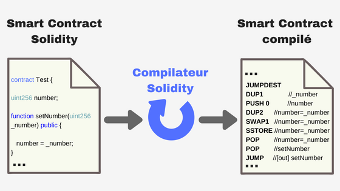

Utiliser le réseau Ethereum n’est pas gratuit. Pour chaque utilisation du réseau (envoi d’Ether, tokens…) vous allez consommer du Gas. Ce Gas correspond aux frais de transaction. Contrairement à Bitcoin, où vous payez des frais suivant la taille de la transaction, **avec Ethereum, vous allez payer des frais suivant sa complexité.**

## Pourquoi payer ?

Les applications décentralisées sur le réseau Ethereum sont exécutées sur chaque ordinateur du réseau.
Lorsque vous achetez des Tokens par exemple, un Smart Contract va être exécuté pour associer votre adresse à un montant en Token. Ce Smart Contract va être exécuté sur chaque ordinateur du réseau Ethereum.

Le coût de l’exécution permet de ne pas spammer le réseau. Si quelqu’un décide de faire une boucle infinidans un Smart Contract par exemple, ce sont tous les ordinateurs du réseau qui vont faire cette boucle. Le coût en gas va augmenter au fil des boucles effectuées, et la personne se retrouvera à court d’Ether au bout d’un moment.

**Le coût en gas permet de sécuriser le réseau pour ne pas abuser de celui-ci.**

## Le Gas

Pour écrire un Smart Contract, le langage de programmation principal est Solidity. **Le code écrit avec Solidity est compilé en une séquence d’opérations**, avant d’être déployé dans la Blockchain Ethereum. **Chaque opération a un coût fixe en gas.**

Le coût de chaque opération est présent dans le yellow paper (Appendix G.) :<a href="https://ethereum.github.io/yellowpaper/paper.pdf" target="_blank" title="yellow paper ethereum" rel="noopener nofollow">Yellow paper</a>

Ici les opérations sont : "**DUP1**", "**PUSH 0**" etc.

Lorsque vous utilisez le réseau Ethereum, votre transaction va exécuter des opérations. Vous allez donc dépenser des unités de gas en fonction des opérations exécutées. **Plus il y a d’opérations exécutées, plus vous consommez du gas.**

Il serait impossible de modifier le coût des opérations à chaque fois que la valeur de l’Ether change. C’est pourquoi, **un coût en Ether doit être associé à 1 unité de gas.** C’est le gas price.

## Le Gas price

Comment convertir le gas en Ether ? **Le gas price représente le coût d’une unité de gas en Ether :**

> Frais de transaction = montant total en unité de gas (pour chaque opération exécutée) x gas price

**Pour faire simple, plus vous exécutez de code, plus vous payez de frais.**

Le gas et le gas price peuvent être comparés à l’essence que vous consommez avec votre voiture. La capacité de votre réservoir ne bouge pas (comme le coût des opérations). Si votre réservoir fait 50L, il fera toujours 50L. Par contre, le coût de l’essence bouge (tout comme le gas price).

Vos frais en essence sont :

> Frais d’essence = volume d’essence à mettre dans le réservoir * prix de l’essence

Retrouvez le prix du gas en temps réel sur :<a href="https://ethgasstation.info/" target="_blank" title="ethereum gas price" rel="noopener nofollow">ethgasstation</a>

## Le Gas limit

Le gas limit permet de spécifier **la valeur limite que vous vous permettez de payer**, lorsque vous allez utiliser le réseau.

Par défaut le coût minimum d’une transaction est de 21000 gas. C’est le cas lorsque vous envoyez de l’Ether vers un autre compte. C’est une transaction simple, le coût en gas s’élève donc à 21000 gas. Pour une interaction avec un Smart Contract, vous allez dépenser : 21 000 gas + le coût en gas des opérations exécutées.

**Si vous spécifiez une limite trop faible** et que la limite de gas est atteinte, l’exécution s’arrête, et votre transaction est annulée. **Vous payez tout de même les ethers,** mais la transaction n’a jamais eu lieu. Si la limite n’est pas atteinte, vous payez seulement le gas nécessaire à l’exécution.

> "Il n’est pas recommandé de mettre une grande limite pour être sûr que la transaction fonctionne. Si le Smart Contract contient un bug inattendu, vous pourriez être amené à payer une somme conséquente."

## Exemple de transaction

Je vais utiliser <a href="https://remix.ethereum.org" target="_blank" title="IDE remix solidity" rel="noopener nofollow">l’IDE remix</a> pour cet exemple. Vous pouvez y écrire vos Smart Contracts et les tester facilement. Reprenons le Smart Contract du schéma plus haut :

Je vais utiliser la fonction "setNumber", qui se charge simplement de stocker un nombre dans le Smart Contract.Elle prend un nombre en paramètre. Je lui passe 5, et je fixe le gas limit à 3 000 000. Voici le résultat de la transaction :

Dans ce tableau, on va s’intéresser à 5 lignes :

1. **"status"** : contient le statut de la transaction. Ici elle s’est bien passée : "Transaction mined and execution succeed".
2. **"gas"** : correspond au gas limit que j’ai fixé : 3 000 000.
3. **"transaction cost"** : contient le coût total de la transaction en gas. Dans cet exemple, 41 669 gas.
4. **"execution cost"** : contient le coût de l’exécution du Smart Contract en gas. Plus il y a de code exécuté, plus le coût est élevé. Ici, le stockage du nombre 5 a coûté 20 205 gas. Si j’avais choisi de le multiplier par 2 en plus, j’aurai dépensé un peu plus de gas.
5. **"decoded input"** : correspond aux paramètres de la fonction exécutée. Soit le nombre 5.

Ici, j’ai donc payé 41 669 gas pour stocker un nombre dans mon Smart Contract. Dans ces 41 669 gas, **j’ai payé 20 205 gas pour le code exécuté** dans la fonction setNumber.

Si on fait le calcul, il reste 41 669 – 20 205 = 21 464 gas.

Pourquoi ai-je payé ces 21 464 gas en plus ? Comme dit précédemment, **toute transaction coûte forcément 21 000 gas de base.** Je ne rentrerais pas dans les détails dans cet article, mais j’ai également payé du gas pour appeler la fonction et lui passer le nombre 5. Ces frais sont donc de 464 gas.

> "Il est possible de calculer ces frais en se servant de la ligne "input", qui contient le code hexadécimal de l’input de la transaction. On peut y retrouver le nom de la fonction appelée et les paramètres passés (ici 5). Il y a ensuite un calcul à faire suivant le nombre de chiffre zéro et non zéro contenu dans ce code"

J’ai donc payé les frais suivant :

1. 21 000 gas de base, comme pour toute transaction.
2. 464 gas pour l’appel de la fonction et le passage du nombre 5.
3. 20 205 gas pour l’exécution du code de la fonction et le stockage du nombre 5.

Ce qui fait un total de 21000 + 464 + 20 205 = 41 669 gas.

**Imaginons maintenant que le coût du gas price à ce moment là soit de 6.** Mes frais s’élèverait donc à 41 669 x 6 = 250 014 Gwei.

Gwei est une unité de mesure en Ether : **1 Ether = 10^8 Gwei**. Pour passer de Gwei en Ether, il faut donc diviser par 10^8. J’ai donc payé la somme de 250 014/10^8 = 0,000250014 Ether.

Dans cet exemple, le coût de la transaction (41 669 gas) ne dépasse pas le gas limit que j’ai fixé (3 000 000 gas). La transaction s’est donc bien passée. Voila ce qui ce serait passé avec un gas limit trop faible :

Reprenons les lignes du tableau :

1. **"status"** : Cette fois, la transaction a échouée : "Transaction mined but execution failed".
2. **"gas"** : J’ai cette fois fixé un gas limit de 22 000 gas (trop faible).
3. **"transaction cost"** : Je n’ai donc payé que 22 000 gas, car je ne peux pas dépenser plus que le gas limit.
4. **"execution cost"** : l’exécution ne s’est pas déroulée entièrement, et n’a donc coûtée que 536 gas (21 000 + 464 + 536 = 22 000).
5. **"decoded input"** : Pas de changement ici, j’ai encore passé le nombre 5.

Comme j’ai défini un gas limit trop faible, la transaction a échouée. L’exécution s’est arrêtée à 22 000 gas dépensé. Le nombre 5 n’est donc pas stocké, mais j’ai tout de même payé 22 000 gas.

## A retenir

1. Faire une transaction sur le réseau Ethereum nous fait exécuter des Smart Contracts (sauf dans certains cas comme l’envoi d’Ether)
2. Les Smart Contracts contiennent des opérations qui coûtent un nombre fixe en gas. Donc plus on exécute de code, plus on dépense du gas.
3. Le gas a un prix qui fluctue en permanence, c’est le gas price.
4. Le coût d’une transaction est donc : **gas utilisés x gas price**. Sachant qu’une transaction coûte de base 21 000 gas.
5. Le gas limit permet de spécifier le nombre maximum de gas pouvant être dépensé dans la transaction. Si on le dépasse, la transaction est annulée, mais on paie tout de même les gas.
