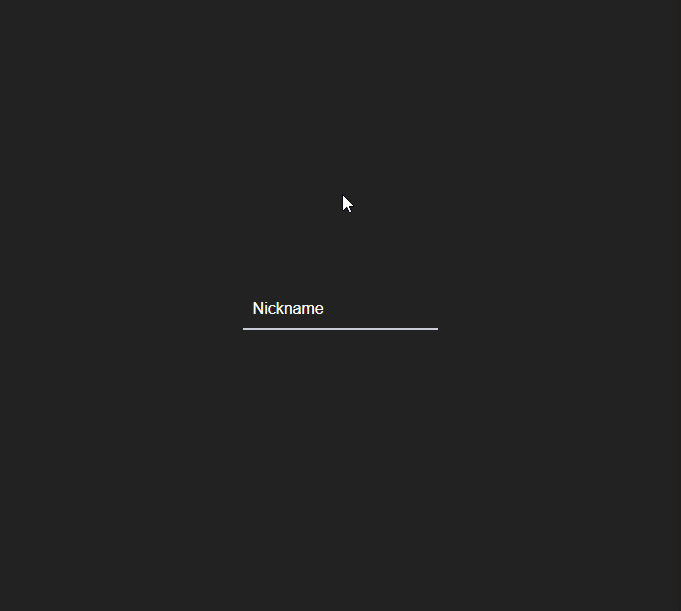

### Objectif du projet :

1. Apprendre React / Redux
2. Comprendre Socket.io
3. Créer un back en NodeJS
4. Apprendre à déployer une application sur Heroku

Le Back-End est en NodeJS. Il est déployé sur Heroku. Il faut donc attendre un peu lors de la première connexion que le back se "réveille", car Heroku met les applications en stand-by lorsqu'elles n'ont pas été utilisées depuis longtemps.

Socket.io est utilisé pour l'envoi et la réception des données.

Le Front est développé en React et Redux et est disponible à cette adresse : <a href="https://realtime-react-chat.herokuapp.com/" target="_blank" rel="noopener">Accéder au Tchat</a>

Le code source est disponible ici : <a href="https://github.com/ATesner/react-chat" target="_blank" rel="noopener nofollow">code source</a>