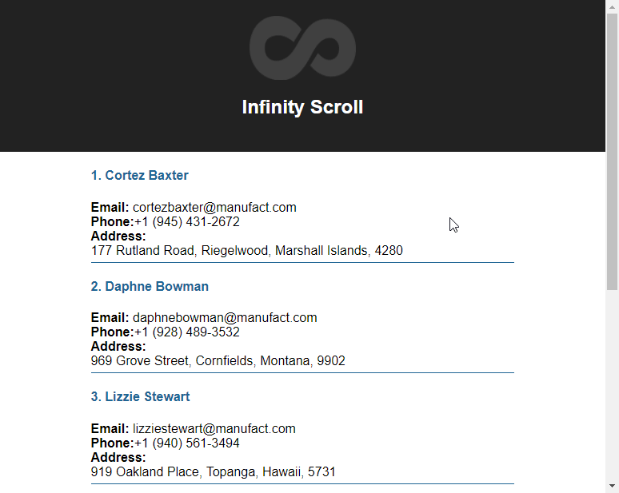

Ce simple composant React permet de charger des données indéfiniment lorsque l'on scroll la page (commentaires, posts etc).

Il suffit simplement de modifier la méthode "get()" du composant ou d'utiliser votre propre méthode. Retouvez toutes les informations dans le Readme du <a href="https://github.com/ATesner/React-Infinity-Scroll" target="_blank" rel="noopener nofollow">repo Github</a>.

Vous pouvez tester le composant sur <a href="https://atesner.github.io/React-Infinity-Scroll/" target="_blank" rel="noopener nofollow">cette page</a>.