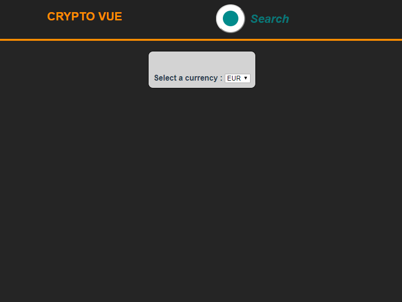

### Objectif du projet

1. Apprendre VUE JS
2. Apprendre Flexbox / Ne pas utiliser Bootstrap
3. Utiliser le stockage local du navigateur

L'application permet de suivre des crypto-monnaies : taux, market cap... Il faut rechercher une crypto monnaie pour l'ajouter au dashboard. Les informations sont tirées de l'API <a href="https://coinmarketcap.com/" target="_blank" rel="noopener nofollow">coinmarketcap.com,</a> et sont sauvegardées en local dans le navigateur. L'état du dashboard est donc automatiquement sauvegardé.

Le code est disponible <a href="https://github.com/ATesner/crypto-vue" target="_blank" rel="noopener nofollow">ICI.</a>

Testez l'application <a href="https://atesner.github.io/crypto-vue/" target="_blank" rel="noopener nofollow">ICI.</a>